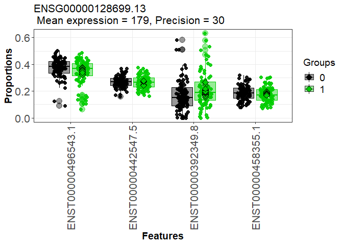

## R Markdown

This is an R Markdown file documenting the code to assess placental
transcript usage differences across infants dichotimized at the median
based on maternal toe nail arsenic concentrations in the RICHS cohort.
Placental RNAseq data that was quantified using salmon and analyzed
using the DRIMseq R package. The workflow followed the same alignment,
sample exclusions and gene filtering parameters as the RICHS SGA DTU
analysis. The final dataset included 171 placenta. Analyses were
adjusted for maternal race, infant sex and metal analysis batch.

## load library

``` r
library(tableone)
library(tidyverse)
library(corrplot)
library(DRIMSeq)
library(TxDb.Hsapiens.UCSC.hg38.knownGene)
library(tximport)
library(rtracklayer)
library(stageR)
library(biomaRt)
library(enrichR)
```

## load covariate data

## Format coldata file

<!-- --><!-- -->

## Demographic characteristics of study population (above vs. below As median (n=171))

``` r
coldata_As_nosmoke<-coldata%>%
  filter(!is.na(As_cat)&Smoke=="No"|is.na(Smoke))%>%
  dplyr::select(-Smoke)%>%
  mutate(BWgroup=factor(BWgroup),
    ID=as.character(ID))%>%
  dplyr::select(ID,BWgroup,Gender,Momrace,Delivery,Parity,BWgrams,GAweeks,Momage,BMI,Batch.MoBT,As.MoBT,Cd.MoBT,As_cat,Cd_cat)

myVars <- names(coldata_As_nosmoke)[!names(coldata_As_nosmoke)=='ID']
catVars <- c("Gender", "BWgroup", "Delivery", "Momrace","Parity","Batch.MoBT","As_cat","Cd_cat")
tab <- CreateTableOne(vars = myVars, data = coldata_As_nosmoke, strata = "As_cat",factorVars = catVars)
options(width=100)
print(tab,showAllLevels = T)
```

    ##                      Stratified by As_cat
    ##                       level            0                1                p      test
    ##   n                                         86               85                     
    ##   BWgroup (%)         AGA                   51 ( 59.3)       47 ( 55.3)   0.557     
    ##                       SGA                   11 ( 12.8)       16 ( 18.8)             
    ##                       LGA                   24 ( 27.9)       22 ( 25.9)             
    ##   Gender (%)          Male                  43 ( 50.0)       42 ( 49.4)   1.000     
    ##                       Female                43 ( 50.0)       43 ( 50.6)             
    ##   Momrace (%)         White                 72 ( 83.7)       66 ( 77.6)   0.064     
    ##                       Black                  6 (  7.0)        2 (  2.4)             
    ##                       Other                  8 (  9.3)       17 ( 20.0)             
    ##   Delivery (%)        Vaginal               39 ( 45.3)       49 ( 57.6)   0.145     
    ##                       Cesarian Section      47 ( 54.7)       36 ( 42.4)             
    ##   Parity (%)          0                     32 ( 37.6)       24 ( 28.2)   0.253     
    ##                       1                     53 ( 62.4)       61 ( 71.8)             
    ##   BWgrams (mean (SD))                  3584.67 (612.00) 3533.24 (670.65)  0.601     
    ##   GAweeks (mean (SD))                    39.13 (0.98)     39.09 (0.88)    0.813     
    ##   Momage (mean (SD))                     31.92 (4.18)     31.59 (4.19)    0.607     
    ##   BMI (mean (SD))                        26.86 (6.19)     26.33 (6.69)    0.586     
    ##   Batch.MoBT (%)      1                      6 (  7.0)       15 ( 17.6)   0.092     
    ##                       2                     13 ( 15.1)       12 ( 14.1)             
    ##                       3                      6 (  7.0)        5 (  5.9)             
    ##                       4                     21 ( 24.4)       26 ( 30.6)             
    ##                       5                     13 ( 15.1)       14 ( 16.5)             
    ##                       6                     27 ( 31.4)       13 ( 15.3)             
    ##   As.MoBT (mean (SD))                     0.03 (0.01)      0.07 (0.05)   <0.001     
    ##   Cd.MoBT (mean (SD))                     0.01 (0.01)      0.02 (0.02)    0.142     
    ##   As_cat (%)          0                     86 (100.0)        0 (  0.0)  <0.001     
    ##                       1                      0 (  0.0)       85 (100.0)             
    ##   Cd_cat (%)          0                     42 ( 48.8)       44 ( 51.8)   0.818     
    ##                       1                     44 ( 51.2)       41 ( 48.2)

## import transcript data

``` r
files=file.path('../quants',list.files('../quants'),"quant.sf")
names(files) = coldata$ID

txi <- tximport(files, type="salmon", txOut=TRUE,
                countsFromAbundance="scaledTPM")
```

## load transcript/gene annotations

``` r
load("txdb_protein_coding_GENEID.RData")
codingSubset<-unique(as.character(codingSubset))#19901
txdb <- loadDb("gencode.v28.annotation.sqlite")
txdf <- AnnotationDbi::select(txdb, keys(txdb, "GENEID"), "TXNAME", "GENEID")
tab <- table(txdf$GENEID)
txdf$ntx <- tab[match(txdf$GENEID, names(tab))] #58381 genes, 203835 transcripts
txdf<-txdf[txdf$GENEID%in%codingSubset,] #19901 genes, 149592 transcripts
```

## DRIMSeq SGA vs. AGA

``` r
#Prepare dataset for DRIMseq
cts <- txi$counts #203027 transcripts, 199 samples
cts <- cts[rowSums(cts) > 0,] #199878 transcripts

cts<-cts[rownames(cts)%in%txdf$TXNAME,] #subset to protein-coding: 124598 transcripts

dim(cts)
#147015    199

range(colSums(cts)/1e6)
#between 0.76 and 28.3 million single-end reads were mapped to the transcriptome using Salmon.


all(rownames(cts) %in% txdf$TXNAME) #TRUE
txdf <- txdf[match(rownames(cts),txdf$TXNAME),]
all(rownames(cts) == txdf$TXNAME) #TRUE

#generate dataset for DTU analysis
coldata_As_nosmoke<-coldata_As_nosmoke%>%
  mutate(across(everything(),~replace_na(.x, 0)))


counts <- data.frame(gene_id=txdf$GENEID,
                     feature_id=txdf$TXNAME,
                     cts[, coldata_As_nosmoke$ID])
names(counts)<-gsub("X","",names(counts))

samps<-data.frame(sample_id=coldata_As_nosmoke$ID,race=coldata_As_nosmoke$Momrace,sex=coldata_As_nosmoke$Gender,batch=coldata_As_nosmoke$Batch.MoBT,group=coldata_As_nosmoke$As_cat)

d_As <- dmDSdata(counts=counts, samples=samps) 
methods(class=class(d_As))

d_As
#An object of class dmDSdata
#with 19839 genes and 142 samples
counts(d_As[1,])[,1:4]


##################  Filtering 
n <- 171
n.small <- 85
d_As <- dmFilter(d_As,
              min_samps_feature_expr=n.small, min_feature_expr=10,
              min_samps_feature_prop=n.small, min_feature_prop=0.1,
              min_samps_gene_expr=n, min_gene_expr=10)

#in a minimum of 30 samples, transcript count of at least 10 , relative abundance proportion of at least 0.1 of total gene expression, and total gene count of at least 10.

d_As # 5057 genes and 171

table(table(counts(d_As)$gene_id)) 
#   2    3    4    5    6    7    8 
#1652 1697 1187  483   90    6    1 

##DTU
design_full <- model.matrix(~ race+sex+batch+group, data=DRIMSeq::samples(d_As))
colnames(design_full)

set.seed(1)
d_As <- dmPrecision(d_As, design=design_full, verbose=1,BPPARAM = BiocParallel::SerialParam())
d_As <- dmFit(d_As, design=design_full, verbose=1,BPPARAM = BiocParallel::SerialParam())
d_As <- dmTest(d_As, coef="group1", verbose=1,BPPARAM = BiocParallel::SerialParam())

save(d_As, file="Metals/As/d_As.RData")

res<-DRIMSeq::results(d_As) #gene level differences
res <- res[order(res$pvalue, decreasing = FALSE), ]
res.txp<-DRIMSeq::results(d_As,level="feature") #feature level differences

#replace NA p-values with 1
length(res$pvalue[is.na(res$pvalue)])#0

no.na <- function(x) ifelse(is.na(x), 1, x)
res$pvalue <- no.na(res$pvalue)
res.txp$pvalue <- no.na(res.txp$pvalue)

save(res,file="Metals/As/As_res.RData")
save(res.txp,file="Metals/As/As_res.txp.RData")
```

## posthoc filtering based on standard deviation of proportions

``` r
smallProportionSD <- function(d, filter = 0.1) {
        # Generate count table
        cts = as.matrix(subset(counts(d), select = -c(gene_id, feature_id)))
        # Summarise count total per gene
        gene.cts = rowsum(cts, counts(d)$gene_id)
        # Use total count per gene as count per transcript
        total.cts = gene.cts[match(counts(d)$gene_id, rownames(gene.cts)),]
        # Calculate proportion of transcript in gene
        props = cts/total.cts
        rownames(props) = rownames(total.cts)
        
        # Calculate standard deviation
        propSD = sqrt(rowVars(props))
        # Check if standard deviation of per-sample proportions is < 0.1
        propSD < filter
}

filt = smallProportionSD(d_As)

res.txp.filt = DRIMSeq::results(d_As, level = "feature")
res.txp.filt$pvalue[filt] = 1
res.txp.filt$adj_pvalue[filt] = 1

table(filt)

#FALSE  TRUE 
# 5277 10640  

table(res.txp$adj_pvalue < 0.05)
#FALSE  TRUE 
#15979    11  

table(res.txp.filt$adj_pvalue < 0.05)
#FALSE  TRUE 
#15992     6  

save(res.txp.filt,file="Metals/As/As_res.txp.filt.RData")
```

## stage R correction

``` r
load("Metals/As/As_res.Rdata")
nrow(res) #5057
load("Metals/As/As_res.txp.filt.RData")
nrow(res.txp.filt) #15998
load("Metals/As/d_As.RData")
##strip gene and transcript version numbers
pScreen <- res$pvalue
strp <- function(x) substr(x,1,15)
names(pScreen) <- strp(res$gene_id)

pConfirmation <- matrix(res.txp.filt$pvalue, ncol=1)
rownames(pConfirmation) <- strp(res.txp.filt$feature_id)

#dataframe with gene and transcript identifiers
tx2gene <- res.txp.filt[,c("feature_id", "gene_id")]
for (i in 1:2) tx2gene[,i] <- strp(tx2gene[,i])


stageRObj <- stageRTx(pScreen=pScreen, pConfirmation=pConfirmation,
                      pScreenAdjusted=FALSE, tx2gene=tx2gene)
stageRObj <- stageWiseAdjustment(stageRObj, method="dtu", alpha=0.05,allowNA=TRUE)
suppressWarnings({
  drim.padj <- getAdjustedPValues(stageRObj, order=TRUE,
                                  onlySignificantGenes=TRUE)
})

length(unique(drim.padj[drim.padj$transcript < 0.05,]$geneID)) #16

table(drim.padj$transcript < 0.05)
#FALSE  TRUE 
#52     10  

write.csv(drim.padj,file="Metals/As/As_topgenes.csv")
```

## Link Ensembl IDs to hgnc IDs

``` r
top.genes<-read.csv("Metals/As/As_topgenes.csv")
top.genes<-as.character(unique(top.genes$geneID[!is.na(top.genes$transcript)]))#55

ensembl = useMart(dataset="hsapiens_gene_ensembl",biomart='ensembl')
filters=listFilters(ensembl)
#identify relevant attributes
attributes=listAttributes(ensembl)

ensembl_id<-getBM(attributes=c('hgnc_symbol','ensembl_gene_id','chromosome_name','start_position','end_position'),filters='ensembl_gene_id', values=top.genes, mart=ensembl)

ensembl_id<-drim.padj%>%
  left_join(ensembl_id,c("geneID"="ensembl_gene_id"))%>%
  relocate(hgnc_symbol)%>%
  arrange(hgnc_symbol)


write.csv(ensembl_id,file="Metals/As/As_drimseq_adjp_hgnc.csv")
```

## gene ontology enrichment analysis

``` r
As_adj_hgnc<-read.csv("Metals/As/As_drimseq_adjp_hgnc.csv") #16
  
listEnrichrSites()
setEnrichrSite("Enrichr") # Human genes
websiteLive <- TRUE
dbs <- listEnrichrDbs()


dbs <- c("GO_Molecular_Function_2021", "GO_Cellular_Component_2021", "GO_Biological_Process_2021", "KEGG_2021_Human")
if (websiteLive) {
    enriched <- enrichr(unique(As_adj_hgnc$hgnc_symbol), dbs)
}
```

    ## Uploading data to Enrichr... Done.
    ##   Querying GO_Molecular_Function_2021... Done.
    ##   Querying GO_Cellular_Component_2021... Done.
    ##   Querying GO_Biological_Process_2021... Done.
    ##   Querying KEGG_2021_Human... Done.
    ## Parsing results... Done.

``` r
if (websiteLive) plotEnrich(enriched[[1]], showTerms = 20, numChar = 40, y = "Count", orderBy = "P.value")
```

<!-- -->

``` r
#none survive FDR < 0.05
```

##DRIMSeq As plots of DTU genes

``` r
load("Metals/As/As_res.RData")
nrow(res) #5057
```

    ## [1] 5057

``` r
load("Metals/As/As_res.txp.filt.RData")
nrow(res.txp.filt) #15998
```

    ## [1] 15998

``` r
load("Metals/As/d_As.RData")


top.hgnc<-read.csv("Metals/As/As_drimseq_adjp_hgnc.csv")

top.genes<-top.hgnc%>%
  group_by(geneID)%>%
  filter(transcript<0.05)%>%
  distinct(geneID,.keep_all = TRUE)%>%
  dplyr::select(hgnc_symbol,geneID,txID,gene,transcript)

#82 genes

for (i in 1:nrow(top.genes))
{
  top_gene_id<-grep(top.genes$geneID[i], res$gene_id, perl=TRUE, value=TRUE)
  pdf(paste0("Metals/Plots/As/d_As_",top.genes$hgnc_symbol[i],"_2",".pdf"))  
  print(plotProportions(d_As, gene_id=top_gene_id, group_variable ="group",group_colors=c("black","green3"),plot_type = "boxplot2"))
  dev.off()
}

#print ORMDL1 plot
top_gene_id<-grep(top.genes$geneID[top.genes$hgnc_symbol=="ORMDL1"], res$gene_id, perl=TRUE, value=TRUE)
plotProportions(d_As, gene_id=top_gene_id, group_variable ="group",group_colors=c("black","green3"),plot_type = "boxplot1")
```

<!-- -->
