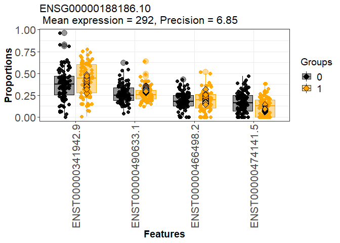

## R Markdown

This is an R Markdown file documenting the code to assess placental
transcript usage differences across infants dichotimized at the median
based on maternal toe nail cadmium concentrations in the RICHS cohort.
Placental RNCdeq data that was quantified using salmon and analyzed
using the DRIMseq R package. The workflow followed the same alignment,
sample exclusions and gene filtering parameters as the RICHS SGA DTU
analysis. The final dataset included 171 placenta. Analyses were
adjusted for maternal race, infant sex and metal analysis batch.

## load library

``` r
library(tableone)
library(tidyverse)
library(corrplot)
library(DRIMSeq)
library(TxDb.Hsapiens.UCSC.hg38.knownGene)
library(tximport)
library(rtracklayer)
library(stageR)
library(biomaRt)
library(enrichR)
```

## load covariate data

## Format coldata file

<!-- --><!-- -->

## Demographic characteristics of study population (above vs. below Cd median (n=171))

``` r
coldata_Cd_nosmoke<-coldata%>%
  filter(!is.na(Cd_cat)&Smoke=="No"|is.na(Smoke))%>%
  dplyr::select(-Smoke)%>%
  mutate(BWgroup=factor(BWgroup),
    ID=as.character(ID))%>%
  dplyr::select(ID,BWgroup,Gender,Momrace,Delivery,Parity,BWgrams,GAweeks,Momage,BMI,Batch.MoBT,Cd.MoBT,Cd.MoBT,As_cat,Cd_cat)

myVars <- names(coldata_Cd_nosmoke)[!names(coldata_Cd_nosmoke)=='ID']
catVars <- c("Gender", "BWgroup", "Delivery", "Momrace","Parity","Batch.MoBT","As_cat","Cd_cat")
tab <- CreateTableOne(vars = myVars, data = coldata_Cd_nosmoke, strata = "Cd_cat",factorVars = catVars)
options(width=100)
print(tab,showAllLevels = T)
```

    ##                      Stratified by Cd_cat
    ##                       level            0                1                p      test
    ##   n                                         86               85                     
    ##   BWgroup (%)         AGA                   45 ( 52.3)       53 ( 62.4)   0.354     
    ##                       SGA                   14 ( 16.3)       13 ( 15.3)             
    ##                       LGA                   27 ( 31.4)       19 ( 22.4)             
    ##   Gender (%)          Male                  54 ( 62.8)       31 ( 36.5)   0.001     
    ##                       Female                32 ( 37.2)       54 ( 63.5)             
    ##   Momrace (%)         White                 70 ( 81.4)       68 ( 80.0)   0.755     
    ##                       Black                  3 (  3.5)        5 (  5.9)             
    ##                       Other                 13 ( 15.1)       12 ( 14.1)             
    ##   Delivery (%)        Vaginal               42 ( 48.8)       46 ( 54.1)   0.591     
    ##                       Cesarian Section      44 ( 51.2)       39 ( 45.9)             
    ##   Parity (%)          0                     28 ( 32.9)       28 ( 32.9)   1.000     
    ##                       1                     57 ( 67.1)       57 ( 67.1)             
    ##   BWgrams (mean (SD))                  3570.21 (680.23) 3547.87 (601.36)  0.820     
    ##   GAweeks (mean (SD))                    39.09 (0.93)     39.13 (0.94)    0.799     
    ##   Momage (mean (SD))                     32.15 (3.94)     31.35 (4.39)    0.212     
    ##   BMI (mean (SD))                        27.13 (6.57)     26.05 (6.29)    0.276     
    ##   Batch.MoBT (%)      1                      8 (  9.3)       13 ( 15.3)  <0.001     
    ##                       2                     19 ( 22.1)        6 (  7.1)             
    ##                       3                      8 (  9.3)        3 (  3.5)             
    ##                       4                     40 ( 46.5)        7 (  8.2)             
    ##                       5                      8 (  9.3)       19 ( 22.4)             
    ##                       6                      3 (  3.5)       37 ( 43.5)             
    ##   Cd.MoBT (mean (SD))                     0.00 (0.00)      0.03 (0.02)   <0.001     
    ##   As_cat (%)          0                     42 ( 48.8)       44 ( 51.8)   0.818     
    ##                       1                     44 ( 51.2)       41 ( 48.2)             
    ##   Cd_cat (%)          0                     86 (100.0)        0 (  0.0)  <0.001     
    ##                       1                      0 (  0.0)       85 (100.0)

## import transcript data

``` r
files=file.path('../quants',list.files('../quants'),"quant.sf")
names(files) = coldata$ID

txi <- tximport(files, type="salmon", txOut=TRUE,
                countsFromAbundance="scaledTPM")
```

## load transcript/gene annotations

``` r
load("txdb_protein_coding_GENEID.RData")
codingSubset<-unique(as.character(codingSubset))#19901
txdb <- loadDb("gencode.v28.annotation.sqlite")
txdf <- AnnotationDbi::select(txdb, keys(txdb, "GENEID"), "TXNAME", "GENEID")
tab <- table(txdf$GENEID)
txdf$ntx <- tab[match(txdf$GENEID, names(tab))] #58381 genes, 203835 transcripts
txdf<-txdf[txdf$GENEID%in%codingSubset,] #19901 genes, 149592 transcripts
```

## DRIMSeq above vs. below median Cd

``` r
#Prepare dataset for DRIMseq
cts <- txi$counts #203027 transcripts, 199 samples
cts <- cts[rowSums(cts) > 0,] #199878 transcripts

cts<-cts[rownames(cts)%in%txdf$TXNAME,] #subset to protein-coding: 124598 transcripts

dim(cts)
#147015    199

range(colSums(cts)/1e6)
#between 0.76 and 28.3 million single-end reads were mapped to the transcriptome using Salmon.


all(rownames(cts) %in% txdf$TXNAME) #TRUE
txdf <- txdf[match(rownames(cts),txdf$TXNAME),]
all(rownames(cts) == txdf$TXNAME) #TRUE

#generate dataset for DTU analysis
coldata_Cd_nosmoke<-coldata_Cd_nosmoke%>%
  mutate(across(everything(),~replace_na(.x, 0)))


counts <- data.frame(gene_id=txdf$GENEID,
                     feature_id=txdf$TXNAME,
                     cts[, coldata_Cd_nosmoke$ID])
names(counts)<-gsub("X","",names(counts))

samps<-data.frame(sample_id=coldata_Cd_nosmoke$ID,race=coldata_Cd_nosmoke$Momrace,sex=coldata_Cd_nosmoke$Gender,batch=coldata_Cd_nosmoke$Batch.MoBT,group=coldata_Cd_nosmoke$Cd_cat)

d_Cd <- dmDSdata(counts=counts, samples=samps) 
methods(class=class(d_Cd))

d_Cd
#An object of class dmDSdata
#with 19839 genes and 142 samples
counts(d_Cd[1,])[,1:4]


##################  Filtering 
n <- 171
n.small <- 85
d_Cd <- dmFilter(d_Cd,
              min_samps_feature_expr=n.small, min_feature_expr=10,
              min_samps_feature_prop=n.small, min_feature_prop=0.1,
              min_samps_gene_expr=n, min_gene_expr=10)

#in a minimum of 30 samples, transcript count of at least 10 , relative abundance proportion of at least 0.1 of total gene expression, and total gene count of at least 10.

d_Cd # 5057 genes and 171

table(table(counts(d_Cd)$gene_id)) 
#   2    3    4    5    6    7    8 
#1617 1680 1182  479   93    5    1 

##DTU
design_full <- model.matrix(~ race+sex+batch+group, data=DRIMSeq::samples(d_Cd))
colnames(design_full)

set.seed(1)
d_Cd <- dmPrecision(d_Cd, design=design_full, verbose=1,BPPARAM = BiocParallel::SerialParam())
d_Cd <- dmFit(d_Cd, design=design_full, verbose=1,BPPARAM = BiocParallel::SerialParam())
d_Cd <- dmTest(d_Cd, coef="group1", verbose=1,BPPARAM = BiocParallel::SerialParam())

save(d_Cd, file="Metals/Cd/d_Cd.RData")

res<-DRIMSeq::results(d_Cd) #gene level differences
res <- res[order(res$pvalue, decreasing = FALSE), ]
res.txp<-DRIMSeq::results(d_Cd,level="feature") #feature level differences

#replace NA p-values with 1
length(res$pvalue[is.na(res$pvalue)])#0

no.na <- function(x) ifelse(is.na(x), 1, x)
res$pvalue <- no.na(res$pvalue)
res.txp$pvalue <- no.na(res.txp$pvalue)

save(res,file="Metals/Cd/Cd_res.RData")
save(res.txp,file="Metals/Cd/Cd_res.txp.RData")
```

## posthoc filtering based on standard deviation of proportions

``` r
smallProportionSD <- function(d, filter = 0.1) {
        # Generate count table
        cts = as.matrix(subset(counts(d), select = -c(gene_id, feature_id)))
        # Summarise count total per gene
        gene.cts = rowsum(cts, counts(d)$gene_id)
        # Use total count per gene as count per transcript
        total.cts = gene.cts[match(counts(d)$gene_id, rownames(gene.cts)),]
        # Calculate proportion of transcript in gene
        props = cts/total.cts
        rownames(props) = rownames(total.cts)
        
        # Calculate standard deviation
        propSD = sqrt(rowVars(props))
        # Check if standard deviation of per-sample proportions is < 0.1
        propSD < filter
}

filt = smallProportionSD(d_Cd)

res.txp.filt = DRIMSeq::results(d_Cd, level = "feature")
res.txp.filt$pvalue[filt] = 1
res.txp.filt$adj_pvalue[filt] = 1

table(filt)

#FALSE  TRUE 
# 5277 10640  

table(res.txp$adj_pvalue < 0.05)
#FALSE  TRUE 
#15857   133 

table(res.txp.filt$adj_pvalue < 0.05)
#FALSE  TRUE 
#15940    58

save(res.txp.filt,file="Metals/Cd/Cd_res.txp.filt.RData")
```

## stage R correction

``` r
load("Metals/Cd/Cd_res.Rdata")
nrow(res) #5057
load("Metals/Cd/Cd_res.txp.filt.RData")
nrow(res.txp.filt) #15998
load("Metals/Cd/d_Cd.RData")
##strip gene and transcript version numbers
pScreen <- res$pvalue
strp <- function(x) substr(x,1,15)
names(pScreen) <- strp(res$gene_id)

pConfirmation <- matrix(res.txp.filt$pvalue, ncol=1)
rownames(pConfirmation) <- strp(res.txp.filt$feature_id)

#dataframe with gene and transcript identifiers
tx2gene <- res.txp.filt[,c("feature_id", "gene_id")]
for (i in 1:2) tx2gene[,i] <- strp(tx2gene[,i])


stageRObj <- stageRTx(pScreen=pScreen, pConfirmation=pConfirmation,
                      pScreenAdjusted=FALSE, tx2gene=tx2gene)
stageRObj <- stageWiseAdjustment(stageRObj, method="dtu", alpha=0.05,allowNA=TRUE)
suppressWarnings({
  drim.padj <- getAdjustedPValues(stageRObj, order=TRUE,
                                  onlySignificantGenes=TRUE)
})

length(unique(drim.padj[drim.padj$transcript < 0.05,]$geneID)) #160

table(drim.padj$transcript < 0.05)
#FALSE  TRUE 
#473   103 

write.csv(drim.padj,file="Metals/Cd/Cd_topgenes.csv")
```

## Link Ensembl IDs to hgnc IDs

``` r
top.genes<-read.csv("Metals/Cd/Cd_topgenes.csv")
top.genes<-as.character(unique(top.genes$geneID[!is.na(top.genes$transcript)]))#55

ensembl = useMart(dataset="hsapiens_gene_ensembl",biomart='ensembl')
filters=listFilters(ensembl)
#identify relevant attributes
attributes=listAttributes(ensembl)

ensembl_id<-getBM(attributes=c('hgnc_symbol','ensembl_gene_id','chromosome_name','start_position','end_position'),filters='ensembl_gene_id', values=top.genes, mart=ensembl)

ensembl_id<-drim.padj%>%
  left_join(ensembl_id,c("geneID"="ensembl_gene_id"))%>%
  relocate(hgnc_symbol)%>%
  arrange(hgnc_symbol)


write.csv(ensembl_id,file="Metals/Cd/Cd_drimseq_adjp_hgnc.csv")
```

## gene ontology enrichment analysis

``` r
Cd_adj_hgnc<-read.csv("Metals/Cd/Cd_drimseq_adjp_hgnc.csv") #16
  
listEnrichrSites()
setEnrichrSite("Enrichr") # Human genes
websiteLive <- TRUE
dbs <- listEnrichrDbs()


dbs <- c("GO_Molecular_Function_2021", "GO_Cellular_Component_2021", "GO_Biological_Process_2021", "KEGG_2021_Human")
if (websiteLive) {
    enriched <- enrichr(unique(Cd_adj_hgnc$hgnc_symbol), dbs)
}
```

    ## Uploading data to Enrichr... Done.
    ##   Querying GO_Molecular_Function_2021... Done.
    ##   Querying GO_Cellular_Component_2021... Done.
    ##   Querying GO_Biological_Process_2021... Done.
    ##   Querying KEGG_2021_Human... Done.
    ## Parsing results... Done.

``` r
if (websiteLive) plotEnrich(enriched[[1]], showTerms = 20, numChar = 40, y = "Count", orderBy = "P.value")
```

<!-- -->

##DRIMSeq Cd plots of DTU genes

``` r
load("Metals/Cd/Cd_res.RData")
nrow(res) #5057
```

    ## [1] 5057

``` r
load("Metals/Cd/Cd_res.txp.filt.RData")
nrow(res.txp.filt) #15998
```

    ## [1] 15998

``` r
load("Metals/Cd/d_Cd.RData")


top.hgnc<-read.csv("Metals/Cd/Cd_drimseq_adjp_hgnc.csv")

top.genes<-top.hgnc%>%
  group_by(geneID)%>%
  filter(transcript<0.05)%>%
  distinct(geneID,.keep_all = TRUE)%>%
  dplyr::select(hgnc_symbol,geneID,txID,gene,transcript)

#73 genes

for (i in 1:nrow(top.genes))
{
  top_gene_id<-grep(top.genes$geneID[i], res$gene_id, perl=TRUE, value=TRUE)
  pdf(paste0("Metals/Plots/Cd/d_Cd_",top.genes$hgnc_symbol[i],"_2",".pdf"))  
  print(plotProportions(d_Cd, gene_id=top_gene_id, group_variable ="group",group_colors=c("black","orange"),plot_type = "boxplot2"))
  dev.off()
}

#print LAMTOR4 plot
top_gene_id<-grep(top.genes$geneID[top.genes$hgnc_symbol=="LAMTOR4"], res$gene_id, perl=TRUE, value=TRUE)
plotProportions(d_Cd, gene_id=top_gene_id, group_variable ="group",group_colors=c("black","orange"),plot_type = "boxplot1")
```

<!-- -->
