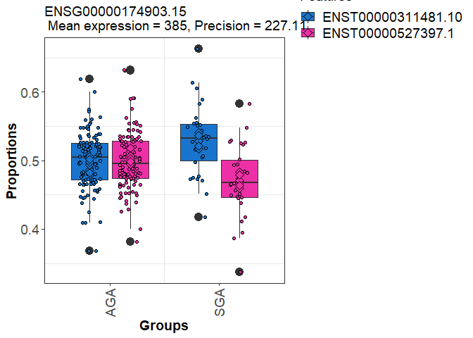

## R Markdown

This is an R Markdown file documenting the code to assess transcript
usage differences across BW categories RICHS placental RNAseq data that
was quantified using salmon and analyzed using the DRIMseq R package.
The workflow followed the guidelines outlined by Mike Love
(<http://www.bioconductor.org/packages/devel/workflows/vignettes/rnaseqDTU/inst/doc/rnaseqDTU.html>)
and this tutorial:
<https://ycl6.gitbook.io/guide-to-rna-seq-analysis/differential-expression-analysis/differential-transcript-usage/dtu-using-drimseq>.
Salmon alignment was performed using gencode v28. One aligned quant file
(21732) was removed from the dataset (mismatched gender). The data was
restricted to protein-coding genes. Samples were subsetted to the
contrast between SGA and AGA infants. Smokers (n=2) were removed to
evaluated non-smoke related impacts of cadmium. The final dataset
(n=142) differed by maternal ethnicity between SGA and AGA infants.
Analyses were adjusted for maternal race.

## load library

``` r
library(tableone)
library(tidyverse)
library(corrplot)
library(DRIMSeq)
library(TxDb.Hsapiens.UCSC.hg38.knownGene)
library(tximport)
library(rtracklayer)
library(stageR)
library(biomaRt)
library(enrichR)
```

## load covariate data

## Format coldata file

## Demographic characteristics of study population (SGA vs. AGA (n=142))

``` r
coldata_SGA_nosmoke<-coldata%>%
  filter(!BWgroup=='LGA'&Smoke=="No"|is.na(Smoke))%>%
  dplyr::select(-Smoke)%>%
  mutate(BWgroup=factor(BWgroup),
    ID=as.character(ID))%>%
  dplyr::select(ID,BWgroup,Gender,Momrace,Delivery,Parity,BWgrams,GAweeks,Momage,BMI,As.MoBT,Cd.MoBT)

myVars <- names(coldata_SGA_nosmoke)[!names(coldata_SGA_nosmoke)=='ID']
catVars <- c("Gender", "BWgroup", "Delivery", "Momrace","Parity")
tab <- CreateTableOne(vars = myVars, data = coldata_SGA_nosmoke, strata = "BWgroup",factorVars = catVars)
options(width=100)
print(tab,showAllLevels = T)
```

    ##                      Stratified by BWgroup
    ##                       level            AGA              SGA              p      test
    ##   n                                        112               30                     
    ##   BWgroup (%)         AGA                  112 (100.0)        0 (  0.0)  <0.001     
    ##                       SGA                    0 (  0.0)       30 (100.0)             
    ##   Gender (%)          Male                  55 ( 49.1)       10 ( 33.3)   0.182     
    ##                       Female                57 ( 50.9)       20 ( 66.7)             
    ##   Momrace (%)         White                 91 ( 81.2)       17 ( 56.7)  <0.001     
    ##                       Black                  2 (  1.8)        6 ( 20.0)             
    ##                       Other                 19 ( 17.0)        7 ( 23.3)             
    ##   Delivery (%)        Vaginal               65 ( 58.0)       18 ( 60.0)   1.000     
    ##                       Cesarian Section      47 ( 42.0)       12 ( 40.0)             
    ##   Parity (%)          0                     40 ( 36.0)       16 ( 53.3)   0.132     
    ##                       1                     71 ( 64.0)       14 ( 46.7)             
    ##   BWgrams (mean (SD))                  3436.77 (388.87) 2581.17 (288.13) <0.001     
    ##   GAweeks (mean (SD))                    39.07 (0.93)     38.90 (1.21)    0.403     
    ##   Momage (mean (SD))                     31.14 (4.61)     32.47 (5.44)    0.181     
    ##   BMI (mean (SD))                        25.58 (5.85)     26.03 (7.27)    0.721     
    ##   As.MoBT (mean (SD))                     0.04 (0.03)      0.07 (0.08)    0.023     
    ##   Cd.MoBT (mean (SD))                     0.02 (0.02)      0.01 (0.01)    0.674

## import transcript data

``` r
files=file.path('../quants',list.files('../quants'),"quant.sf")
names(files) = coldata$ID

txi <- tximport(files, type="salmon", txOut=TRUE,
                countsFromAbundance="scaledTPM")
```

## load transcript/gene annotations

``` r
load("txdb_protein_coding_GENEID.RData")
codingSubset<-unique(as.character(codingSubset))#19901
txdb <- loadDb("gencode.v28.annotation.sqlite")
txdf <- AnnotationDbi::select(txdb, keys(txdb, "GENEID"), "TXNAME", "GENEID")
tab <- table(txdf$GENEID)
txdf$ntx <- tab[match(txdf$GENEID, names(tab))] #58381 genes, 203835 transcripts
txdf<-txdf[txdf$GENEID%in%codingSubset,] #19901 genes, 149592 transcripts
```

## DRIMSeq SGA vs. AGA

``` r
#Prepare dataset for DRIMseq
cts <- txi$counts #203027 transcripts, 199 samples
cts <- cts[rowSums(cts) > 0,] #199878 transcripts

cts<-cts[rownames(cts)%in%txdf$TXNAME,] #subset to protein-coding: 124598 transcripts

dim(cts)
#147015    199

range(colSums(cts)/1e6)
#between 0.76 and 28.3 million single-end reads were mapped to the transcriptome using Salmon.


all(rownames(cts) %in% txdf$TXNAME) #TRUE
txdf <- txdf[match(rownames(cts),txdf$TXNAME),]
all(rownames(cts) == txdf$TXNAME) #TRUE

#generate dataset for DTU analysis
coldata_SGA_nosmoke<-coldata_SGA_nosmoke%>%
  mutate(across(everything(),~replace_na(.x, 0)))


counts <- data.frame(gene_id=txdf$GENEID,
                     feature_id=txdf$TXNAME,
                     cts[, coldata_SGA_nosmoke$ID])
names(counts)<-gsub("X","",names(counts))

samps<-data.frame(sample_id=coldata_SGA_nosmoke$ID,race=coldata_SGA_nosmoke$Momrace,sex=coldata_SGA_nosmoke$Gender,group=coldata_SGA_nosmoke$BWgroup)

d_SGA <- dmDSdata(counts=counts, samples=samps) 
methods(class=class(d_SGA))

d_SGA
#An object of class dmDSdata
#with 19839 genes and 142 samples
counts(d_SGA[1,])[,1:4]


##################  Filtering 
n <- 142
n.small <- 30
d_SGA <- dmFilter(d_SGA,
              min_samps_feature_expr=n.small, min_feature_expr=10,
              min_samps_feature_prop=n.small, min_feature_prop=0.1,
              min_samps_gene_expr=n, min_gene_expr=10)

#in a minimum of 30 samples, transcript count of at least 10 , relative abundance proportion of at least 0.1 of total gene expression, and total gene count of at least 10.

d_SGA # 5660 genes and 142

table(table(counts(d_SGA)$gene_id)) 
#  2    3    4    5    6    7    8    9   
# 873 1298 1373 1115  652  262   68   19 


##DTU
design_full <- model.matrix(~ race+sex+group, data=DRIMSeq::samples(d_SGA))
colnames(design_full)

set.seed(1)
d_SGA <- dmPrecision(d_SGA, design=design_full, verbose=1,BPPARAM = BiocParallel::SerialParam())
d_SGA <- dmFit(d_SGA, design=design_full, verbose=1,BPPARAM = BiocParallel::SerialParam())
d_SGA <- dmTest(d_SGA, coef="groupSGA", verbose=1,BPPARAM = BiocParallel::SerialParam())

save(d_SGA, file="SGA/d_SGA.RData")

res<-DRIMSeq::results(d_SGA) #gene level differences
res <- res[order(res$pvalue, decreasing = FALSE), ]
res.txp<-DRIMSeq::results(d_SGA,level="feature") #feature level differences

#replace NA p-values with 1
length(res$pvalue[is.na(res$pvalue)])#0

no.na <- function(x) ifelse(is.na(x), 1, x)
res$pvalue <- no.na(res$pvalue)
res.txp$pvalue <- no.na(res.txp$pvalue)

save(res,file="SGA/SGA_res.RData")
save(res.txp,file="SGA/SGA_res.txp.RData")
```

## posthoc filtering based on standard deviation of proportions

``` r
smallProportionSD <- function(d, filter = 0.1) {
        # Generate count table
        cts = as.matrix(subset(counts(d), select = -c(gene_id, feature_id)))
        # Summarise count total per gene
        gene.cts = rowsum(cts, counts(d)$gene_id)
        # Use total count per gene as count per transcript
        total.cts = gene.cts[match(counts(d)$gene_id, rownames(gene.cts)),]
        # Calculate proportion of transcript in gene
        props = cts/total.cts
        rownames(props) = rownames(total.cts)
        
        # Calculate standard deviation
        propSD = sqrt(rowVars(props))
        # Check if standard deviation of per-sample proportions is < 0.1
        propSD < filter
}

filt = smallProportionSD(d_SGA)

res.txp.filt = DRIMSeq::results(d_SGA, level = "feature")
res.txp.filt$pvalue[filt] = 1
res.txp.filt$adj_pvalue[filt] = 1

table(filt)
#FALSE  TRUE 
# 5279 17860 

table(res.txp$adj_pvalue < 0.05)
#FALSE  TRUE 
#22963   205 
  
table(res.txp.filt$adj_pvalue < 0.05)
#FALSE  TRUE 
#23092    76 

save(res.txp.filt,file="SGA/SGA_res.txp.filt.RData")
```

## stage R correction

``` r
load("SGA/SGA_res.Rdata")
nrow(res) #5660
load("SGA/SGA_res.txp.filt.RData")
nrow(res.txp) #23168
load("SGA/d_SGA.RData")

#strip gene and transcript version numbers
pScreen <- res$pvalue
strp <- function(x) substr(x,1,15)
names(pScreen) <- strp(res$gene_id)

pConfirmation <- matrix(res.txp.filt$pvalue, ncol=1)
rownames(pConfirmation) <- strp(res.txp.filt$feature_id)

#dataframe with gene and transcript identifiers
tx2gene <- res.txp.filt[,c("feature_id", "gene_id")]
for (i in 1:2) tx2gene[,i] <- strp(tx2gene[,i])


stageRObj <- stageRTx(pScreen=pScreen, pConfirmation=pConfirmation,
                      pScreenAdjusted=FALSE, tx2gene=tx2gene)
stageRObj <- stageWiseAdjustment(stageRObj, method="dtu", alpha=0.05,allowNA=TRUE)
suppressWarnings({
  drim.padj <- getAdjustedPValues(stageRObj, order=TRUE,
                                  onlySignificantGenes=TRUE)
})

length(unique(drim.padj[drim.padj$transcript < 0.05,]$geneID)) #82

table(drim.padj$transcript < 0.05)
#FALSE  TRUE 
#1080    97

write.csv(drim.padj,file="SGA/SGA_topgenes.csv")
```

## Link Ensembl IDs to hgnc IDs

``` r
top.genes<-read.csv("SGA/SGA_topgenes.csv")
top.genes<-as.character(unique(top.genes$geneID[!is.na(top.genes$transcript)]))#75

ensembl = useMart(dataset="hsapiens_gene_ensembl",biomart='ensembl')
filters=listFilters(ensembl)
#identify relevant attributes
attributes=listAttributes(ensembl)

ensembl_id<-getBM(attributes=c('hgnc_symbol','ensembl_gene_id','chromosome_name','start_position','end_position'),filters='ensembl_gene_id', values=top.genes, mart=ensembl)

ensembl_id<-drim.padj%>%
  left_join(ensembl_id,c("geneID"="ensembl_gene_id"))%>%
  filter(transcript<0.05)%>%
  relocate(hgnc_symbol)%>%
  arrange(hgnc_symbol)

write.csv(ensembl_id,file="SGA/SGA_drimseq_adjp_hgnc.csv")
```

## gene ontology enrichment analysis

``` r
SGA_adj_hgnc<-read.csv("SGA/SGA_drimseq_adjp_hgnc.csv") #82
  
listEnrichrSites()
setEnrichrSite("Enrichr") # Human genes
websiteLive <- TRUE
dbs <- listEnrichrDbs()


dbs <- c("GO_Molecular_Function_2021", "GO_Cellular_Component_2021", "GO_Biological_Process_2021", "KEGG_2021_Human")
if (websiteLive) {
    enriched <- enrichr(unique(SGA_adj_hgnc$hgnc_symbol), dbs)
}
```

    ## Uploading data to Enrichr... Done.
    ##   Querying GO_Molecular_Function_2021... Done.
    ##   Querying GO_Cellular_Component_2021... Done.
    ##   Querying GO_Biological_Process_2021... Done.
    ##   Querying KEGG_2021_Human... Done.
    ## Parsing results... Done.

``` r
if (websiteLive) plotEnrich(enriched[[1]], showTerms = 20, numChar = 40, y = "Count", orderBy = "P.value")
```

<!-- -->

##DRIMSeq SGA plots of DTU genes

``` r
load("SGA/SGA_res.RData")
nrow(res) #5660
```

    ## [1] 5660

``` r
load("SGA/SGA_res.txp.filt.RData")
nrow(res.txp.filt) #23168
```

    ## [1] 23168

``` r
load("SGA/d_SGA.RData")


top.hgnc<-read.csv("SGA/SGA_drimseq_adjp_hgnc.csv")

top.genes<-top.hgnc%>%
  group_by(geneID)%>%
  filter(transcript<0.05)%>%
  distinct(geneID,.keep_all = TRUE)%>%
  dplyr::select(hgnc_symbol,geneID,txID,gene,transcript)

#82 genes

for (i in 1:nrow(top.genes))
{
  top_gene_id<-grep(top.genes$geneID[i], res$gene_id, perl=TRUE, value=TRUE)
  pdf(paste0("SGA/Plots/d_SGA_",top.genes$hgnc_symbol[i],"_2",".pdf"))  
  print(plotProportions(d_SGA, gene_id=top_gene_id, group_variable ="group",group_colors=c("black","mediumorchid1"),plot_type = "boxplot2"))
  dev.off()
}

#print INHBA plot
top_gene_id<-grep(top.genes$geneID[top.genes$hgnc_symbol=="INHBA"], res$gene_id, perl=TRUE, value=TRUE)
plotProportions(d_SGA, gene_id=top_gene_id, group_variable ="group",group_colors=c("black","mediumorchid1"),plot_type = "boxplot2")
```

<!-- -->

``` r
#print ITGAV plot
top_gene_id<-grep(top.genes$geneID[top.genes$hgnc_symbol=="ITGAV"], res$gene_id, perl=TRUE, value=TRUE)
plotProportions(d_SGA, gene_id=top_gene_id, group_variable ="group",group_colors=c("black","mediumorchid1"),plot_type = "boxplot2")
```

<!-- -->

``` r
#print NAA20 plot
top_gene_id<-grep(top.genes$geneID[top.genes$hgnc_symbol=="NAA20"], res$gene_id, perl=TRUE, value=TRUE)
plotProportions(d_SGA, gene_id=top_gene_id, group_variable ="group",group_colors=c("black","mediumorchid1"),plot_type = "boxplot2")
```

<!-- -->

``` r
#print RAB1B plot
top_gene_id<-grep(top.genes$geneID[top.genes$hgnc_symbol=="RAB1B"], res$gene_id, perl=TRUE, value=TRUE)
plotProportions(d_SGA, gene_id=top_gene_id, group_variable ="group",group_colors=c("black","mediumorchid1"),plot_type = "boxplot2")
```

<!-- -->
